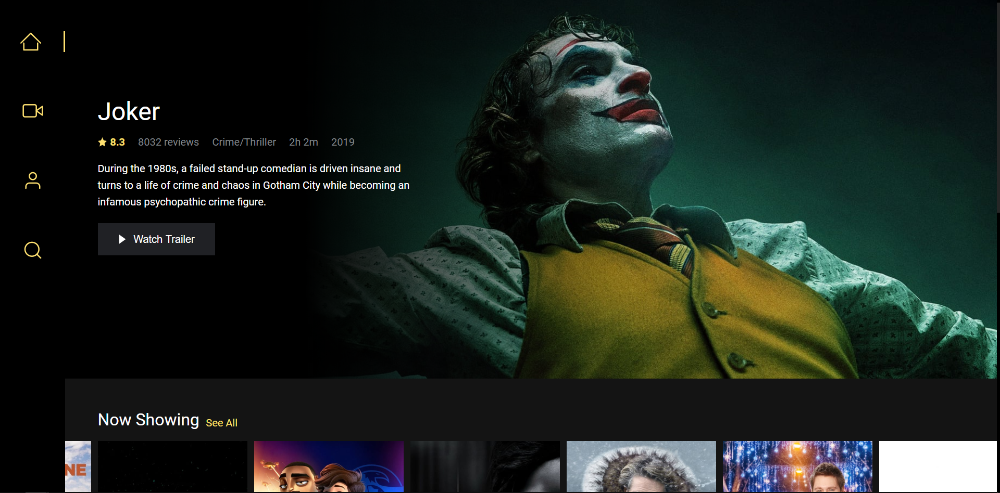
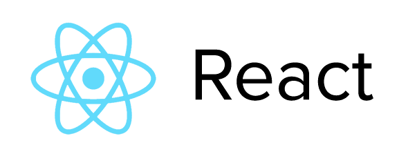

# Movion

[](https://app.netlify.com/sites/movion/deploys)

Your daily dose of movie updates.

### Live

[https://movion.hiwijaya.com](https://movion.hiwijaya.com)

### Build with

<a href="https://reactjs.org/" rel="ReactJS">
  
</a>

### Configure

Get the repo

```sh
git clone https://github.com/hiwijaya/movion.git
cd movion
yarn install or npm install
```

Add `.env.development` or `.env.production` to your root directory and add the following

```js
REACT_APP_TMDB_API_KEY=[YOUR_TMDb_API_KEY]
```

To get TMDb_API_KEY you must registered in [TMDb](https://www.themoviedb.org).

### Data provided by

<a href="https://www.themoviedb.org" rel="TMDb">
  
</a>

### License

Movion is [MIT Licensed](https://github.com/hiwijaya/movion/blob/master/LICENSE)

Thank you.

<a href="https://www.buymeacoffee.com/hiwijaya" rel="buymeacoffee">
  
</a>
